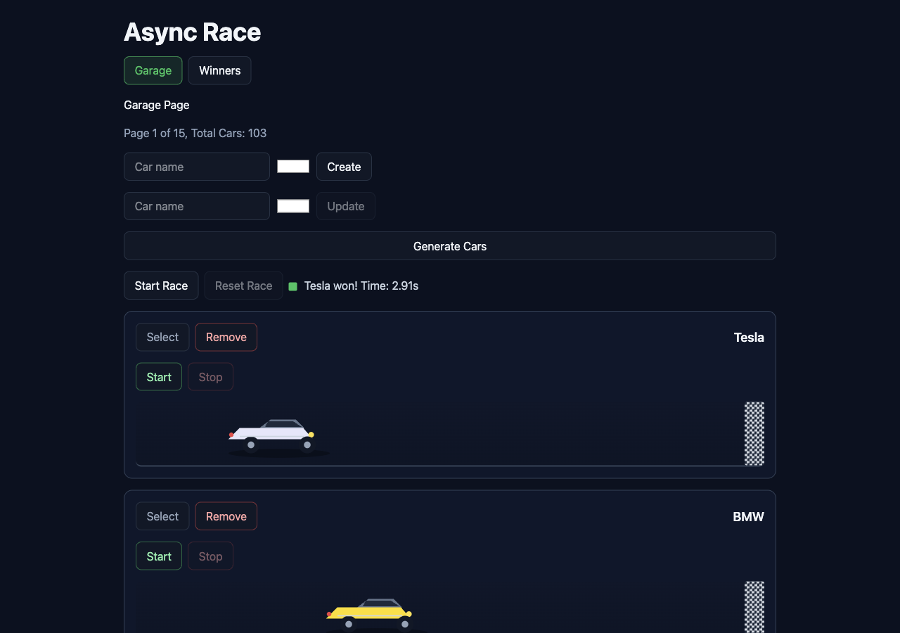
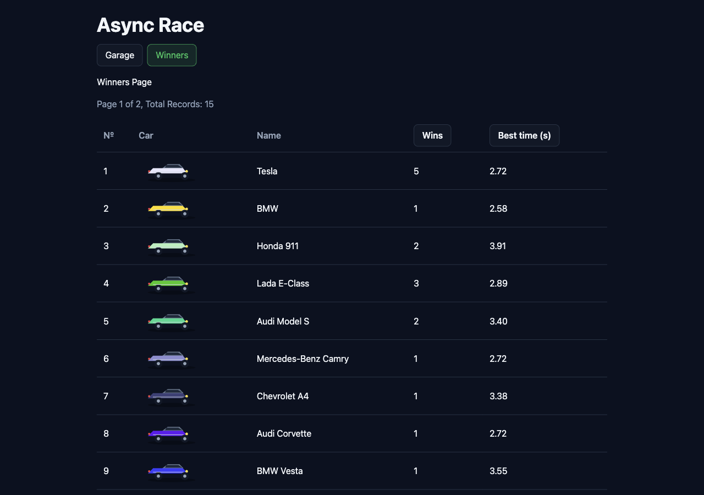

# Async Race

Single Page Application for drag-racing radio-controlled cars. Built with vanilla TypeScript, Vite and the native DOM API — no UI frameworks.

## Features

- **Garage view** — car CRUD (create / update / delete / list), RGB color picker, pagination (7 cars per page), random generation of 100 cars per click
- **Car engine control** — start / stop per car, `requestAnimationFrame` animation, broken engine stops the car in place on drive `500`
- **Race** — start race for all cars on the page, reset race, winner announcement with car name and time
- **Winners view** — winners table with car image, win count and best time, pagination (10 per page), sorting by wins and best time (asc / desc)
- **State persistence** — page numbers, inputs and selected color survive view switching; hash routing (`#garage`, `#winners`) keeps the current view on refresh

## Screenshots






## Tech stack

- TypeScript (strict, no `any` / `as` / `!`)
- Vite
- Vanilla DOM API
- Tailwind CSS
- ESLint with `eslint-plugin-unicorn`

## Getting started

The app needs the [async-race-api](https://github.com/mikhama/async-race-api) mock server running locally.

```bash
# 1. Run the mock server (separate repo)
git clone https://github.com/mikhama/async-race-api.git
cd async-race-api
npm install
npm start            # serves on http://127.0.0.1:3000

# 2. Run the frontend
cd async-race
npm install
cp .env.example .env # set VITE_API_URL=http://127.0.0.1:3000
npm run dev          # http://localhost:5173
```

## Scripts

| Command            | Description                        |
| ------------------ | ---------------------------------- |
| `npm run dev`      | Start the Vite dev server          |
| `npm run lint`     | Run ESLint                         |
| `npm run typecheck`| Run TypeScript check (`tsc --noEmit`) |
| `npm run build`    | Typecheck + lint + production build |

## Project structure

```
src/
├── api/        # fetch layer (garage, engine, winners)
├── components/ # UI building blocks (button, car card, forms, navigation, pagination)
├── pages/      # view composition (garage, winners)
├── router/     # hash routing
├── state/      # application state (garage, winners)
├── utils/      # animation, type guards, helpers
├── types/      # shared types
└── main.ts     # entry point
```

## Deployment

The app is configured for GitHub Pages (`base: '/async-race/'` in `vite.config.ts`):

```bash
npm run build
npx gh-pages -d dist
```
